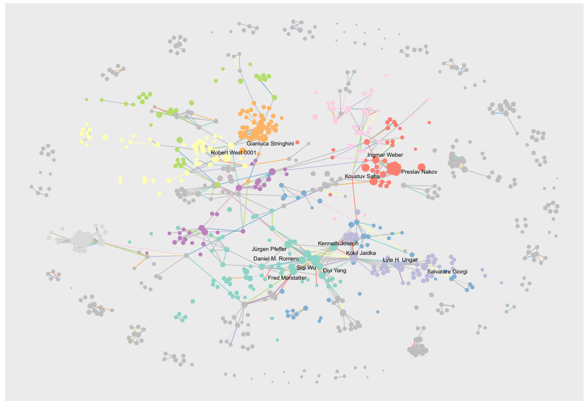
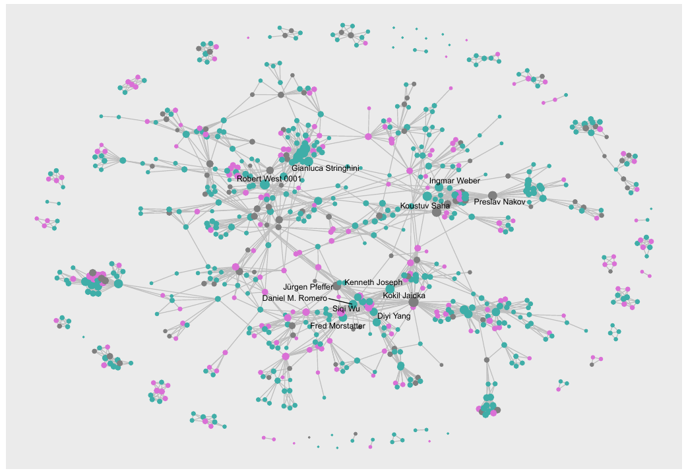
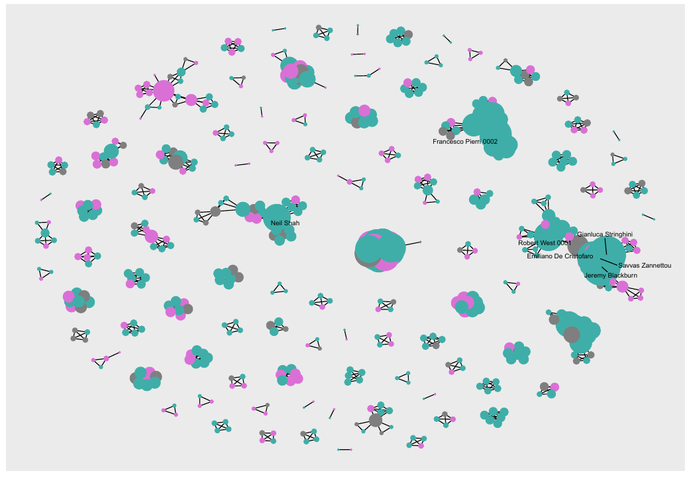
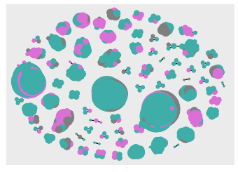
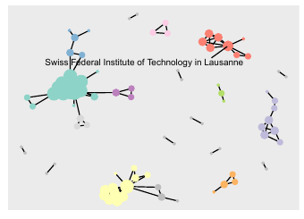

# Network Science Collaboration Analysis

This project applies network science methods to study scientific collaboration patterns across multiple years. The analysis builds co-authorship graphs from author and edge lists, then uses centrality, community detection, institutional affiliation, and inferred gender attributes to explore how collaboration structures evolve over time.

## Objective

The goal is to understand the structure of the collaboration network: which authors occupy central positions, how communities form, how institutional clusters appear in the graph, and how the network changes across yearly snapshots.

## Data

The project uses two prepared CSV files:

- `data/authors_final.csv`: author identifiers, names, and affiliation information.
- `data/edges_final.csv`: co-authorship edges with year and paper identifiers.

The analysis treats co-authorship as an undirected network. Repeated collaborations are aggregated into weighted edges, so stronger ties reflect authors who appear together more often.

## Method

The analysis pipeline is implemented in R:

1. importing author and edge tables with `readr`;
2. manually and algorithmically completing missing institutional affiliations;
3. predicting likely author gender from first names with `predictrace`;
4. constructing weighted co-authorship graphs with `igraph`;
5. filtering central subgraphs using betweenness centrality;
6. computing degree, betweenness, density, diameter, and community structure;
7. detecting communities with Louvain clustering;
8. visualizing networks by community, gender, institution, and year using `ggraph` and `tidygraph`.

## Main Results

### Overall Collaboration Structure

The complete collaboration graph shows a dense core of highly connected authors surrounded by smaller peripheral components. Node size reflects degree, while colors identify the largest Louvain communities.

### Gender Distribution in the Network

The same network can be read through inferred gender attributes. This view makes visible how collaboration clusters are distributed across the predicted gender categories and where central authors sit inside the graph.

### Yearly Evolution

Yearly snapshots show that the collaboration structure changes over time. Some years are more fragmented, while others show larger connected components and more visible collaboration clusters.

### 2023 Network

The 2023 graph highlights larger collaboration groups and several high-degree nodes. The gender-colored version emphasizes the composition of the largest clusters.

### Institutional Clusters

The institutional view connects collaboration patterns to affiliations. In the 2023 snapshot, the Swiss Federal Institute of Technology in Lausanne appears as one of the most visible institutional hubs.

## Main Files

- `script finale.R`: main analysis script for the full and yearly network analysis.
- `script.R`: supporting analysis script used by the Quarto report.
- `analisi per anni complessiva.R`: yearly network analysis.
- `report.qmd`: Quarto report source.
- `data/`: prepared author and edge datasets.

## Presentation Materials

Generated PDFs, HTML reports, RStudio session files, and obsolete draft scripts are not published on GitHub. The essential presentation content is summarized in this README, with selected figures exported to `assets`.
